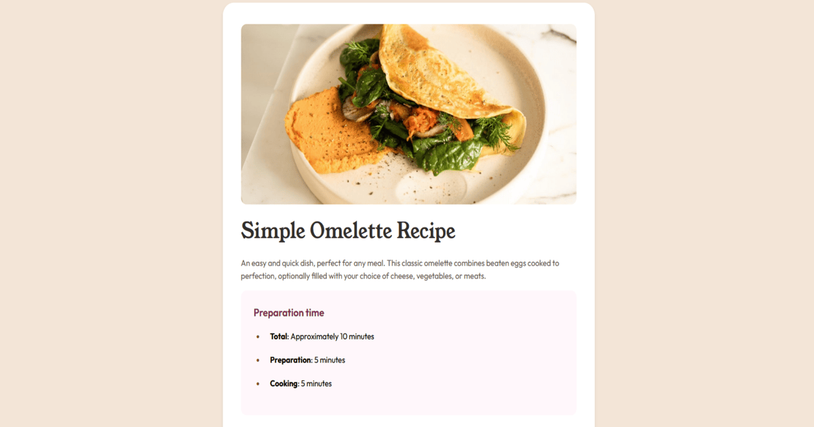

# Recipe Page

The **Recipe Page** project. The goal is to build a responsive cooking recipe page using HTML and CSS, while learning layout techniques, Flexbox, Grid.

---

## Demo

Live demo: [DEMO](https://kamil-engineer.github.io/recipe/)

---

## Features

- Responsive layout for desktop, tablet, and mobile
- Page sections:
  - Header with recipe title
  - Recipe info (prep time, difficulty, servings)
  - Ingredients list
  - Step-by-step instructions
  - Footer with author info
- Clean and user-friendly design, following Frontend Mentor Figma

---

## Technologies

- **HTML5** – semantic structure
- **CSS3** – layout (Flexbox / Grid), responsive styles, typography, colors

## What i Learned

- Building responsive layouts with Flexbox and Grid
- Styling sections and elements (headings, lists)
- Writing semantic HTML
- Organizing a project and publishing it on GitHub

## Author

[Kamil] kamil-engineer
GitHub: https://github.com/kamil-engineer
